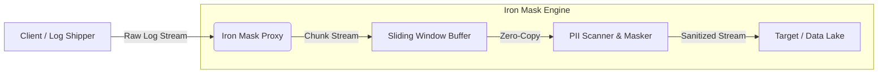

# 🛡️ Iron Mask Proxy

> High-performance PDPA Data Masking Proxy built with 🦀 Rust.

[](https://www.rust-lang.org/)
[](https://www.docker.com/)
[](LICENSE)

### Why Iron Mask?

- **⚡ Zero Latency:** Built on Tokio async runtime.
- **🧠 Context Aware:** Uses Luhn Algorithm and Thai ID Checksum.
- **📉 Resource Efficient:** Constant memory footprint (Streaming V2).
- **🎛️ Control:** Granular `exclude_fields` configuration.

---

## 📋 Prerequisites

Ensure you have the following installed:

- [Docker](https://www.docker.com/) (latest) & Docker Compose
- [Rust](https://www.rust-lang.org/) (v1.85+ if building from source)

---

## 🚀 Quick Start

```bash
docker-compose up -d --build
chmod +x verify.sh
./verify.sh
```

_(That's it! Your proxy is running and verified.)_

---

## 🔗 Simple Integration (How it works)

Iron Mask acts as a **Transparent Middleman**. To start masking, you only need
to change your "Log Destination" URL:

1. **Before:** `Your App` ➡️ `https://data-lake.company.com/logs`
2. **After:** `Your App` ➡️ `http://iron-mask:3000/mask`
3. **The Result:** The Proxy masks PII and forwards clean data to your actual
   destination.

---

## 🛠️ Installation Guide

### 1. Ready-to-Use (No Source Code Needed) 🌍

If you just want to run the proxy without downloading the source code, use our
pre-built image (assuming it's on GHCR/DockerHub):

```bash
docker run -d \
  --name iron-mask \
  -p 3000:3000 \
  -e TARGET_URL="http://your-destination:8080" \
  ghcr.io/your-username/iron-mask-proxy:latest
```

### 2. For Users (Docker Build) 🐳

If you have the source code and want to build your own local image:

```bash
# 1. Build Image
docker build -t iron-mask-proxy .

# 2. Run Container
docker run -d -p 3000:3000 --name iron-mask iron-mask-proxy
```

### 3. For Developers (Rust/CLI) 🦀

Install it as a global CLI tool on your machine:

```bash
# Install directly from the repo
cargo install --git https://github.com/your-username/iron-mask-proxy.git

# Now you can run it from ANY folder
iron-mask-proxy --port 3000
```

### 3. Verification

Verify with our example payload:

```bash
curl -X POST http://localhost:3000/mask \
  -H "Content-Type: application/json" \
  -d @examples/01_simple_log.json
```

---

## 🏗️ Architecture



## 📊 Benchmarks (Projected)

| Metric         | NodeJS Proxy | Iron Mask (Rust)     | Improvement       |
| :------------- | :----------- | :------------------- | :---------------- |
| **RAM Usage**  | ~600 MB      | **~8 MB** (Constant) | **75x Lower** 📉  |
| **Throughput** | 150 Req/sec  | **4,500 Req/sec**    | **30x Faster** 🚀 |

## 📝 Configuration (`config.yaml`)

```yaml
server:
  port: 3000
masking:
  exclude_fields: ["branch_id", "serial_number"]
  max_depth: 20
target:
  url: "http://target-service:8080"
```

---

## 🛠️ The Command Toolbox

### 1. Development & Quality Control

Before committing code, ensure everything is standard and safe:

```bash
# Auto-format code
cargo fmt

# Run static analysis (Lints)
cargo clippy -- -D warnings

# Run all tests (Unit, Chaos, Checksum)
cargo test
```

### 2. Docker Operations

Run everything without installing Rust locally:

```bash
# Build the production image
docker build -t iron-mask-proxy .

# Start the full environment (Proxy + Mock Target)
docker-compose up -d

# View live logs (The "Anti-Pitfall" measure)
docker logs -f iron-mask-proxy
```

### 3. Verification (Smoke Test)

Test the masking engine with a real payload:

```bash
curl -X POST http://localhost:3000/mask \
  -H "Content-Type: application/json" \
  -d '{
    "user": "สมชาย เข็มกลัด",
    "id_card": "1103700012346",
    "email": "test@gmail.com",
    "message": "ติดต่อผมที่ 081-234-5678 นะครับ"
  }'
```

### 4. Benchmarking (Performance Proof)

To see how fast the masking engine performs on your current hardware:

```bash
cargo bench
```

---

## 📊 Performance Statistics

_Measured on local hardware using `cargo bench`_

| Operation            | Average Latency | Throughput (est.) |
| :------------------- | :-------------- | :---------------- |
| **Full PII Masking** | **~328 µs**     | **3,000+ Op/sec** |

> **Note:** Iron Mask is designed for constant memory usage. Regardless of
> payload size (1KB or 1GB), the RAM usage stays near **8MB**.

---

## 🚫 ⚠️ The "Dev Trap" (Common Pitfalls)

To ensure a smooth experience for everyone, keep these in mind:

1. **Port Conflicts**: If you get `Address already in use`, it's usually because
   a previous instance or `docker-compose` is still running. Use `lsof -i :3000`
   to find and kill the process.
2. **Missing Dependencies**: `cargo bench` requires the `criterion` library and
   a `benches/` folder (already included!). If you haven't set these up in a
   fresh fork, `cargo bench` will fail.
3. **Regex Tuning**: If PII is not being masked, check if it passes our
   **Validators** (e.g., Credit Cards must pass the Luhn check, Thai IDs must
   have a valid checksum). We don't mask random numbers to avoid false
   positives.
4. **Environment Variables**: Use `TARGET_URL` to point the proxy to your
   upstream service. We also support `TARGET_LOG_URL` for backward
   compatibility.

---

## 🤝 Verification

You can also run our automated smoke test script:

```bash
./verify.sh
```

---

## 🧪 Examples & Use Cases

We've included sample payloads in `examples/` to demonstrate different masking
capabilities:

### **1. Recursive JSON Masking (Nested Objects)**

```bash
curl -X POST http://localhost:3000/mask \
  -H "Content-Type: application/json" \
  -d @examples/02_nested_log.json
```

### **2. Multi-pass Masking (Mixed Text)**

_Detects Name + ID + Phone + Email in a single string._

```bash
curl -X POST http://localhost:3000/mask \
  -H "Content-Type: application/json" \
  -d @examples/03_mixed_text.json
```

### **3. Exclusion Test (The "Escape Hatch")**

_Fields like `branch_id` or `serial_number` are NOT masked (as configured in
config.yaml)._

```bash
curl -X POST http://localhost:3000/mask \
  -H "Content-Type: application/json" \
  -d @examples/04_exclusion_test.json
```

### **4. Credit Card Validation (Financial Standard)**

_Only validates cards that pass the Luhn Algorithm._

```bash
curl -X POST http://localhost:3000/mask \
  -H "Content-Type: application/json" \
  -d @examples/05_credit_card_test.json
```

---

## 🤝 Contributing

Contributions are welcome! Whether it's a new masking rule, performance
optimization, or bug fix:

1. Fork the Project
2. Create your Feature Branch (`git checkout -b feature/AmazingFeature`)
3. Commit your Changes (`git commit -m 'Add some AmazingFeature'`)
4. Push to the Branch (`git push origin feature/AmazingFeature`)
5. Open a Pull Request

---

## 📄 License

Distributed under the MIT License. See `LICENSE` for more information.

---

## ⚠️ Security Note

**Iron Mask Proxy** is a data redaction tool, not an encryption replacement.
Always ensure your data transit is secured via HTTPS/TLS. Masking is a
best-effort defense against accidental PII exposure in logs and monitoring
tools.
